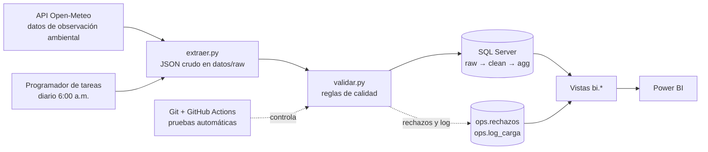

# Pipeline DataOps: clima de Santo Domingo

Sistema que recoge, almacena, procesa y visualiza datos climáticos horarios (temperatura, humedad y precipitación) de Santo Domingo, República Dominicana. Desarrollado con metodología **DataOps**: código versionado, calidad de datos automatizada, ejecución programada, monitoreo y entregas por iteraciones.

## Arquitectura



## Capas de datos (SQL Server, base `ClimaSDQ`)

| Esquema | Tabla / vista | Contenido |
|---|---|---|
| `raw` | `lectura_clima` | Datos tal como llegan de la API |
| `clean` | `lectura_clima` | Datos validados, una fila por hora |
| `agg` | `clima_diario` | Resumen diario (mín., máx., promedio, lluvia, calor extremo) |
| `ops` | `log_carga`, `rechazos` | Registro de cada ejecución y de cada fila rechazada |
| `bi` | `v_clima_horario`, `v_clima_diario`, `v_calidad_datos`, `v_rechazos` | Capa de consumo para Power BI |

## Reglas de calidad

Rechaza una fila si tiene un campo nulo, temperatura fuera de 10 a 45 °C, humedad fuera de 0 a 100 %, precipitación negativa o fecha y hora duplicada dentro del lote. Cada rechazo queda en `ops.rechazos` con su motivo y valor original. La alerta de frescura se activa si la última lectura de una carga incremental tiene más de 72 horas.

## Cómo ejecutarlo

Requisitos: Python 3.12 o superior, SQL Server (Express sirve) y ODBC Driver 18 para SQL Server.

```powershell
python -m venv C:\venvs\clima
C:\venvs\clima\Scripts\Activate.ps1
pip install -r requirements.txt

sqlcmd -S "localhost\SQLEXPRESS" -E -C -i sql\01_crear_base.sql
sqlcmd -S "localhost\SQLEXPRESS" -E -C -i sql\02_agregar_diario.sql
sqlcmd -S "localhost\SQLEXPRESS" -E -C -i sql\03_vistas_bi.sql

python src\pipeline.py historica      # carga base de 12 meses
python src\pipeline.py incremental    # carga diaria
pytest                                # pruebas de calidad de datos

powershell -ExecutionPolicy Bypass -File scripts\registrar_tarea.ps1   # programa la carga diaria
```

La conexión usa autenticación de Windows; el repositorio no contiene credenciales.

## Limitaciones

- Open-Meteo combina observaciones de estaciones, satélites y modelos numéricos; no son mediciones de un sensor propio.
- El servicio de archivo publica con unos 5 días de retraso, por eso la carga incremental vuelve a pedir los últimos 7 días (es idempotente).
- La tarea programada requiere que el equipo esté encendido, con la sesión iniciada y la unidad de Google Drive montada.
- Un día con menos de 24 lecturas se guarda con `dia_completo = 0` y el dashboard lo excluye.

## Fuente de datos

Open-Meteo (https://open-meteo.com), licencia CC BY 4.0. Uso gratuito no comercial.
